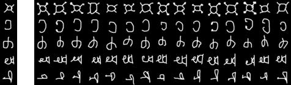

# CSC2541-colab-assignment
[CSC2541](https://www.cs.toronto.edu/~rgrosse/courses/csc2541_2021/) colab assignment
Jax implementation of [MAML](https://arxiv.org/abs/1703.03400)

Few Shot Learning using MAML on Omniglot (image classification)

## Requirements

Python : 3.6

To install dependencies:

```setup
sudo pip3 install -r requirements.txt
```

## Dataset

Omniglot: https://github.com/brendenlake/omniglot

### Preview

A snapshot for single episode. 

5way-1shot-15query (N=5, K=1, Q=15)

left: support set, right: query set

<p align='center'>
  
</p>


## RUN
```
python main.py
```
